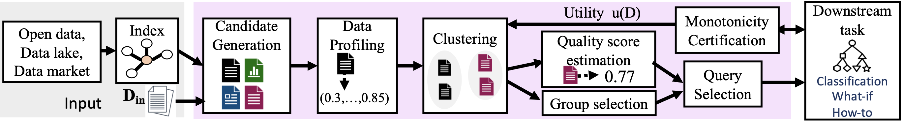

# Metam : Goal-oriented Data Disovery

Metam is a goal-oriented data discovery system that takes a dataset as input and identifies augmentations that optimize a downstream task.
Metam is divided into the following components: Candidate generation and profiling, Clustering, Sequential querying, and group querying.


## Metam Architecture



## Candidate Generation
The implementation allows the user to specify a list of candidates as a csv file. The current implementation has been tested with [https://github.com/mitdbg/aurum-datadiscovery](Aurum). Aurum indexes all datasets in a repository and generates a set of join paths for all datasets in the repository.

## Profiling
The profiling component processes the candidate set of augmentations to generate data profiles like number of null values, correlation between columns, etc.

## Clustering
This component processes the candidate augmentations to generate clusters where profiles are used to calculate similarity between augmentations.

## Sequential Querying
This component chooses representative augmentations and estimates a quality score to rank them. This ranking of augmentations is used to choose the next query.

## Group Querying
This component samples multiple augmentations to query. The sampled set is chosen using Thompson sampling over the set of clusters.


## Setup

Run [https://github.com/mitdbg/aurum-datadiscovery](Aurum) to generate an index containing all joinable datasets. 


```shell
# create virtual environment
$ pip install virtualenv
$ virtualenv --no-site-packages venv
$ source venv/bin/activate 
$ pip3 install --no-deps -r requirements.txt
```

Add this project to python path

```shell
$ export PYTHONPATH="${PYTHONPATH}:/path/to/Metam"
```


## Run Example

Once you have the aurum index, you can try running the end-to-end pipeline in
`examples/example.py`

Before you run, there are several parameters you need to set in the example
file:

```python
path = ''  # path to all datasets
query_data = ''  # name of source table (Initial dataset)
class_attr = '' #column name of prediction attribute

filepath = '' #File containing all join paths identified by Aurum

#Below parameters are set to default values and you can change to simulate variations
epsilon = 0.05 # Metam parameter
theta = 0.90 # Required utility
ninfo=0 # Number of uninformative profiles to be added on top of default set of profiles
```


## To inspect the manually investigated join paths, please download the data from [https://drive.google.com/drive/u/1/folders/1fX2RhFtugiaHwbRF72zW7W9hS89AHHAA]

## For reproducibility, 
Step 1: Please download data from this link 
[https://drive.google.com/drive/u/1/folders/1fX2RhFtugiaHwbRF72zW7W9hS89AHHAA]

Step 2: Generate Aurum indexes for this data

Step 3: Follow the above mentioned steps to setup the repo and run. 
Default parameters are set in src/backend/process_data.py


## To run the demo, you should run:

### `yarn start`

Runs the app in the development mode.\
Open [http://localhost:3000](http://localhost:3000) to view it in your browser.

The page will reload when you make changes.\
You may also see any lint errors in the console.

### `yarn test`

Launches the test runner in the interactive watch mode.\
See the section about [running tests](https://facebook.github.io/create-react-app/docs/running-tests) for more information.

### `yarn build`

Builds the app for production to the `build` folder.\
It correctly bundles React in production mode and optimizes the build for the best performance.

The build is minified and the filenames include the hashes.\
Your app is ready to be deployed!

See the section about [deployment](https://facebook.github.io/create-react-app/docs/deployment) for more information.

### `yarn eject`

**Note: this is a one-way operation. Once you `eject`, you can't go back!**

If you aren't satisfied with the build tool and configuration choices, you can `eject` at any time. This command will remove the single build dependency from your project.

Instead, it will copy all the configuration files and the transitive dependencies (webpack, Babel, ESLint, etc) right into your project so you have full control over them. All of the commands except `eject` will still work, but they will point to the copied scripts so you can tweak them. At this point you're on your own.

You don't have to ever use `eject`. The curated feature set is suitable for small and middle deployments, and you shouldn't feel obligated to use this feature. However we understand that this tool wouldn't be useful if you couldn't customize it when you are ready for it.

## Learn More

You can learn more in the [Create React App documentation](https://facebook.github.io/create-react-app/docs/getting-started).

To learn React, check out the [React documentation](https://reactjs.org/).

### Code Splitting

This section has moved here: [https://facebook.github.io/create-react-app/docs/code-splitting](https://facebook.github.io/create-react-app/docs/code-splitting)

### Analyzing the Bundle Size

This section has moved here: [https://facebook.github.io/create-react-app/docs/analyzing-the-bundle-size](https://facebook.github.io/create-react-app/docs/analyzing-the-bundle-size)

### Making a Progressive Web App

This section has moved here: [https://facebook.github.io/create-react-app/docs/making-a-progressive-web-app](https://facebook.github.io/create-react-app/docs/making-a-progressive-web-app)

### Advanced Configuration

This section has moved here: [https://facebook.github.io/create-react-app/docs/advanced-configuration](https://facebook.github.io/create-react-app/docs/advanced-configuration)

### Deployment

This section has moved here: [https://facebook.github.io/create-react-app/docs/deployment](https://facebook.github.io/create-react-app/docs/deployment)

### `yarn build` fails to minify

This section has moved here: [https://facebook.github.io/create-react-app/docs/troubleshooting#npm-run-build-fails-to-minify](https://facebook.github.io/create-react-app/docs/troubleshooting#npm-run-build-fails-to-minify)
